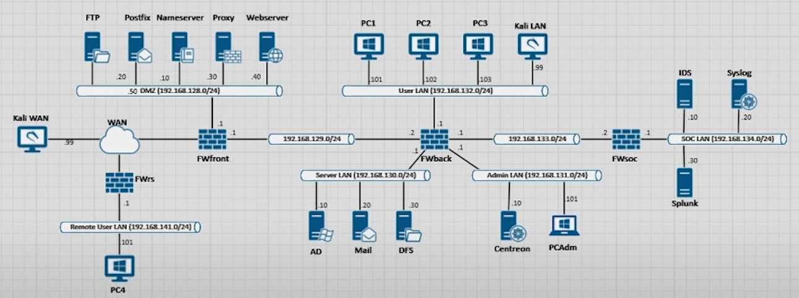
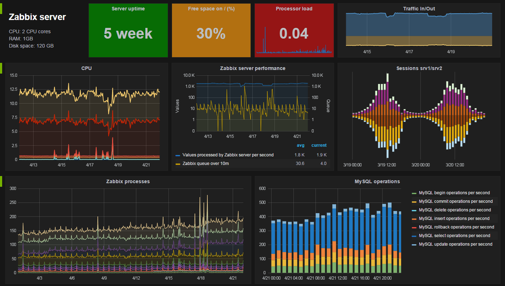
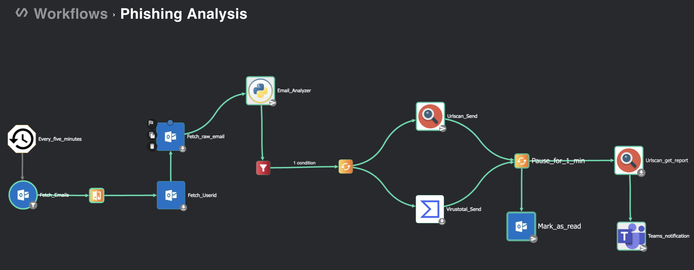

# 🛡️ SOC Project

## 🎯 Objective

This project aims to **set up a functional SOC (Security Operations Center)** in a virtualized cyber simulation platform (Airbus CyberRange) capable of:
- collecting and correlating security logs,
- detecting malicious behaviors and attacks,
- automating incident response,
- monitoring system availability and performance.

---

## 🧱 SOC Architecture

| Component   | Role                                      | Tool Used |
|-------------|-------------------------------------------|------------|
| SIEM        | Log collection, indexing, analysis        | Splunk     |
| EDR         | Endpoint monitoring and protection        | Wazuh      |
| SOAR        | Automated incident response               | Shuffle    |
| Monitoring  | System and service performance tracking   | Zabbix     |
| Network Analysis | Traffic inspection and logging      | Zeek       |
| Vulnerability Scanner | Detect unpatched systems        |	OpenVAS    |
| Forensics	  | Post-incident disk analysis	              | Autopsy    |

---

## 🌐 Technical Environment

- Platform: Airbus CyberRange
- Operating Systems / VMs: Debian 11, Ubuntu 22.04, Windows 11, pfSense (firewall)
- Communication: Syslog, JSON, REST API (Shuffle)

---

## ⚙️ Workflow

1. Endpoints send system, application and security logs to a centralized **Syslog** server.
2. **Wazuh** agents on endpoints detect file changes, privilege escalations, unauthorized access, etc., and forward alerts to **Splunk**.
3. **Zeek** passively monitors and analyzes network traffic (SSH, DNS, HTTP...) and forwards logs to **Splunk**.
4. **Splunk** collects and correlates all incoming logs, then triggers alerts based on defined attack patterns (e.g., brute-force attempts, port scans).
5. **Shuffle** receives alerts from Splunk and executes automated incident response actions: IP blocking, remote commands, email notifications, etc.
6. **Zabbix** monitors system health, service uptime, and resource usage across all machines, sending alerts when anomalies occur.
7. **OpenVAS** performs regular vulnerability scans to detect weaknesses in the infrastructure; results are used to proactively patch systems.
8. In case of a detected compromise, **Autopsy** is used to perform forensic analysis on disk images of affected systems to identify traces of attacker activity.

---

## 📸 Screenshots

| Infrastructure schema example       |
|-------------------------------------|
|  |

| Zabbix monitoring dashboard          |
|--------------------------------------|
|  |

| Shuffle workflow example            |
|-------------------------------------|
|  |

---

## 📜 Example Attack Scenario

📍 **SSH Brute-force Attack on a Linux Endpoint**

- Simulated using `hydra`
- Detected by Zeek (high connection attempts)
- Correlated in Splunk using a custom rule
- Triggered a Shuffle playbook: source IP blocked + SOC team notified via email

---

## 🚀 Possible Improvements

- Add Sigma rules to Splunk
- Integrate MISP for threat enrichment
- Implement Grafana dashboard using Loki for log visualization

---

**Fateh BOULCHERAB**  
📧 boulcherab.fateh@gmail.com  
🔗 [LinkedIn](https://www.linkedin.com/in/bfateh)

